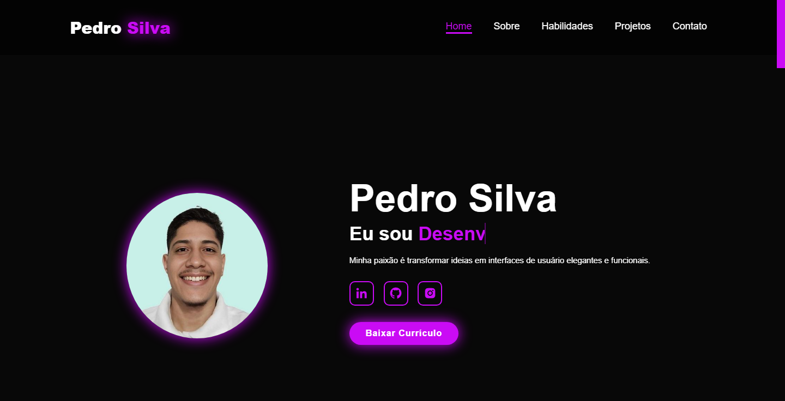

# 🌐 Portfólio Responsivo

Este é um portfólio responsivo desenvolvido com **HTML, CSS e JavaScript**. Ele apresenta meus projetos e habilidades de forma interativa e otimizada para diferentes dispositivos.

## 🚀 Tecnologias Utilizadas

- **HTML5** para a estrutura do site.
- **CSS3** para estilização e responsividade.
- **JavaScript** para interatividade.

## 📸 Demonstração

🔗 [Acesse o portfólio online](https://portfolio-opal-psi-45.vercel.app/)



## 📦 Como Usar

1. Clone este repositório:
   ```bash
   git clone git@github.com:pedrohenrique-23/portfolio.git
   ```
2. Acesse a pasta do projeto:
   ```bash
   cd portfolio
   ```
3. Abra o arquivo `index.html` no navegador.

## 🎨 Recursos

- **Design Responsivo:** Adapta-se a diferentes tamanhos de tela.
- **Animações CSS:** Efeitos sutis para melhorar a experiência do usuário.
- **Seção de Projetos:** Exibição dinâmica dos trabalhos realizados.
- **Formulário de Contato:** Para facilitar a comunicação.

## 🤝 Contribuindo

Se quiser sugerir melhorias ou relatar problemas, sinta-se à vontade para abrir uma issue ou um pull request!

## 📝 Licença

Este projeto está sob a licença MIT. Veja o arquivo [LICENSE](LICENSE) para mais detalhes.

---

Feito com ❤️ por [Pedro Silva](https://github.com/pedrohenrique-23)
